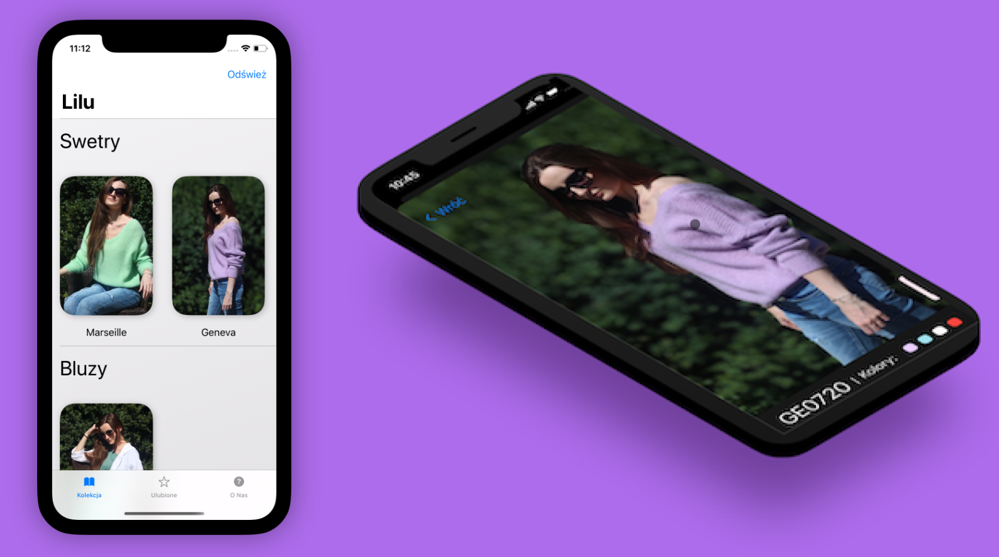

<h1>Developing with passion</h1>
<body>After finishing my bachelor's in Sinology I realized the career of a Mandarin Chinese interpreter is not for me, as it did not allow for much artistic freedom and creativity. Luckily a friend of mine recommended that I should learn programming and it just clicked. I love making iOS apps and being a fan of Apple's ecosystem I design apps according to the criteria of their "magic".   Below you can find my most recent projects, with the topmost soon being my first AppStore release, currently undergoing TestFlight beta. </body>
<h2>Lilu by Gosia</h2>
<body>Lilu is a fashion catalog that uses an external Content Management System and a simple design that makes it very easy to navigate and browse.</body>

<h5>Using: SwiftUI, API calls, MapKit</h5>

[Privacy Policy](/privacy-policy.md)
